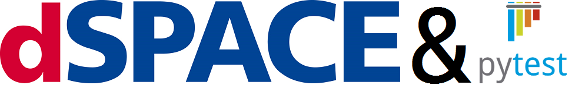
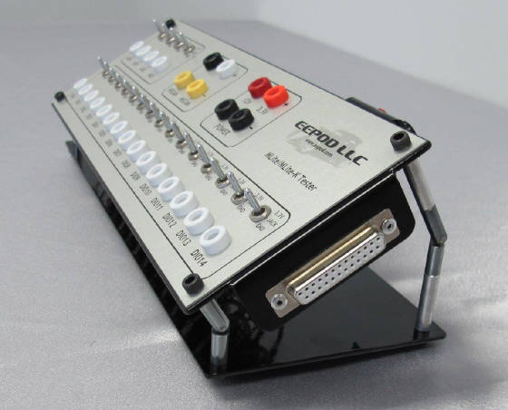

# dSpace HIL Testing with ``pytest``



For the purposes of this article I will follow a fake company "*Common Motors*" and the evolution of testing software for each of their three product lines: Vans, Cars, & Trucks.

## 1. Manual Testing

### On Vehicle Testing

In the dark ages, before the days of hardware in the loop testing, it was a test engineer or technician's job to test everything.  This means that with every release of software they had to sit down and validate all of the features in the software that was released.

For example, in the case of our **CM Truck** line, a software checkout will have started with an engineer sitting in the "CM Truck 101" following a simple checklist:

- [X] Flash Software
- [X] Key On
- [] Start Engine
  - [] Check Idle
  - [] Check Red Line
- [] Test Turn
  - [] Left
  - [] Right
- [] Brake Lights
- [] ...

As time went on managers and engineers both realized this was time consuming and expensive. You had to schedule time to get on a prototype vehicle, the vehicle was unable to do other testing to do a software checkout, etc.

Then along came bench testing.

### Bench Testing



## 2. Automated Testing

In most cases hardware in the loop testing grew organically and in parrallel over time.
For most hardware grou

 in the loop testing grew organically and often in parallel.

In most instances this meant 


```keyswitch.py```:

```
import rtplib2
import CANape

platformIdentifier = "SCALEXIO"
applicationPath = r"C:\TurnSignal_SCALEXIO\BuildResult\turnlamp.sdf"
appl = rtplib2.Appl(applicationPath, platformIdentifier)

canape = canapy.CANape(a2l="turnlamp.a2l",
                       channels=["TurnSignalLevel"])

...

turnSignalLeverValue = appl.Variable("Model Root/TurnSignalLever[-1..1]/Value")

for turn_value in [0.0, 0.5, 1.0]:
    turnSignalLeverValue.Write(turn_value)
    assert canape.TurnSignalLevel == turn_value

...

app.close()
del app
```

## 3. ```pytest```

> *```pytest``` is a mature full-featured Python testing tool that helps you write better programs.* - [pytest.org](http://docs.pytest.org/en/latest/)


> *A software test fixture sets up the system for the testing process by providing it with all the necessary code to initialize it, thereby satisfying whatever preconditions there may be.* - [Wiki: Software Test Fixture](https://en.wikipedia.org/wiki/Test_fixture#Software)


```conftest.py```:

```
import pytest

@pytest.fixture(scope="module",)
def app(request):
    platformIdentifier = "SCALEXIO"
    applicationPath = r"C:\TurnSignal_SCALEXIO\BuildResult\turnlamp.sdf"
    app = rtplib2.Appl(applicationPath, platformIdentifier)
    yield app
    app.close()
    del app

@pytest.fixture(scope="module")
def canape(request):
    yield canapy.CANape(a2l="turnlamp.a2l",
                       channels=["TurnSignalLevel"])
    
```

```test_turnsignal.py```:

```
def test_left(app, canape):
    turnSignalLeverValue = appl.Variable("Model Root/TurnSignalLever[-1..1]/Value")

    for turn_value in [0.0, 0.5, 1.0]:
        turnSignalLeverValue.Write(turn_value)
        assert canape.TurnSignalLevel == turn_value
```

## Further Reading/Watching/Listening

### Articles

- [Why I use py.test and you probably should too](http://halfcooked.com/presentations/pyconau2013/why_I_use_pytest.html)
- [Testing Python Applications with Pytest](https://semaphoreci.com/community/tutorials/testing-python-applications-with-pytest)

### YouTube

- EuroPython 2014
  - [Introduction to pytest](https://www.youtube.com/watch?v=LdVJj65ikRY)
  - [Advanced Uses of py.test Fixtures](https://www.youtube.com/watch?v=IBC_dxr-4ps)
- codebasics
  - [Python unit testing - pytest introduction](https://www.youtube.com/watch?v=l32bsaIDoWk)
  - [Python unit testing - pytest fixtures(https://www.youtube.com/watch?v=IVrGz8w0H8c)
  - [Python unit testing - pytest parameters](https://www.youtube.com/watch?v=2EGgtlf7BN0)
- [Why I use py.test and maybe you should too - PyCon Australia](https://www.youtube.com/watch?v=P-AhpukDIik)

### Podcasts

- [Episode 16 – Holger Krekel \[author of Py.Test\] on Py.Test](https://www.podcastinit.com/episode-16-holger-krekel-on-py-test/) [[mp3](https://www.podcastinit.com/wp-content/uploads/Episode_16_-_Holger_Krekel_on_Pytest.mp3?ptm_source=download&ptm_context=select-button&ptm_request=e7dbc55b990f&ptm_file=Episode_16_-_Holger_Krekel_on_Pytest.mp3#)]
- [Test & Code: pytest with Raphael Pierzina](http://testandcode.com/24) [[mp3](http://aphid.fireside.fm/d/1437767933/bc7f1faf-8aad-4135-bb12-83a8af679756/c51609b4-a8ef-45c7-ac02-2547f9b58929.mp3)]

<a rel="license" href="http://creativecommons.org/licenses/by-sa/4.0/"></a><br />This work is licensed under a <a rel="license" href="http://creativecommons.org/licenses/by-sa/4.0/">Creative Commons Attribution-ShareAlike 4.0 International License</a>.